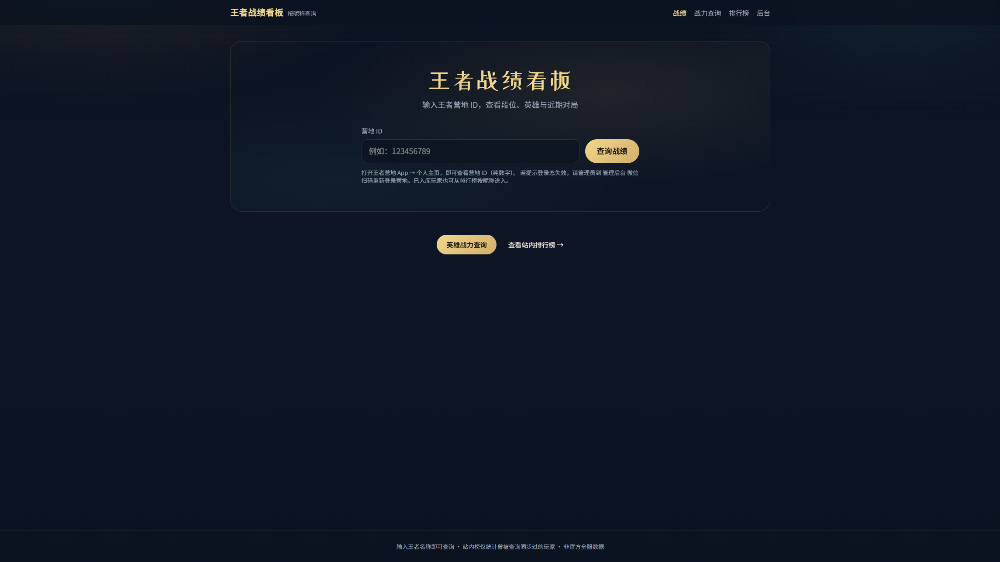
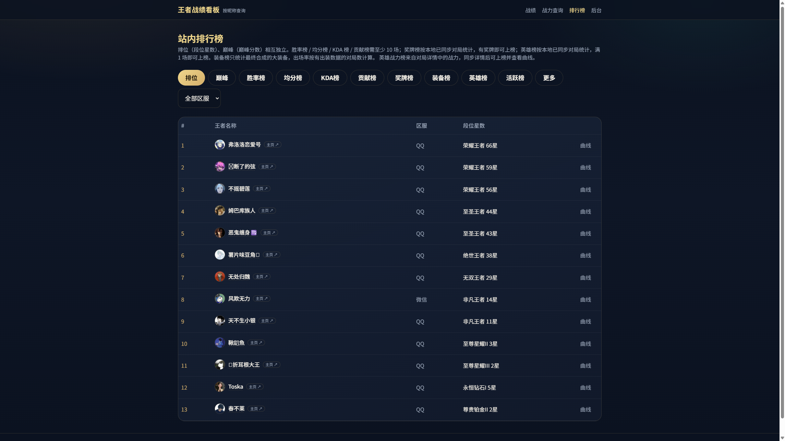
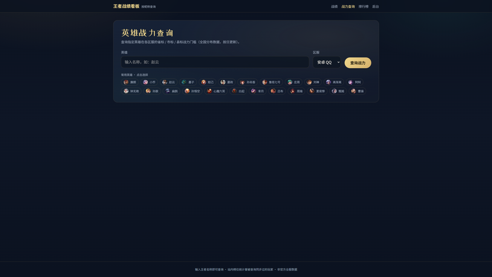
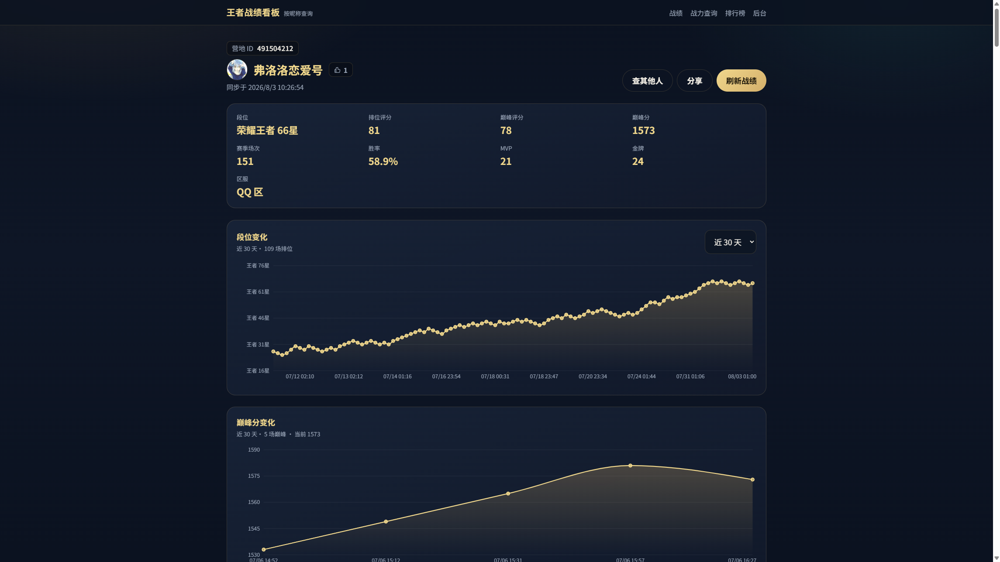

# Honor of Kings Match Dashboard

English | [简体中文](./README.md)

A self-hosted dashboard for looking up Honor of Kings (王者荣耀) player stats by **Camp ID** (王者营地 ID). Visitors do not need to register. An admin signs in to King of Glory Camp via WeChat QR code to sync official match data.

> This is an unofficial third-party project and is not affiliated with Tencent Games or Honor of Kings. Use APIs responsibly and comply with applicable terms of service and laws.

---

## Contents

- [Features](#features)
- [Tech Stack](#tech-stack)
- [Requirements](#requirements)
- [Quick Start](#quick-start)
- [Configuration](#configuration)
- [Security](#security)
- [Usage](#usage)
- [Screenshots](#screenshots)
- [Deployment](#deployment)
- [API Overview](#api-overview)
- [Project Structure](#project-structure)
- [Data Providers](#data-providers)
- [FAQ](#faq)
- [Contributing & License](#contributing--license)

---

## Features

### Public pages

| Page | Description |
|------|-------------|
| Home `/` | Look up and sync stats by Camp ID (5–15 digits) |
| Player `/p/{nickname}` | Rank / peak curves, hero stats (economy / damage / taken / join aggregates), paginated match list (up to 1000 stored locally); official MVP/SVP icons and top / gold / silver / bronze medals; likes (once per browser per day); pollable sync progress |
| Match `/matches/:id` | Single-match detail: economy / damage / taken damage (with team %), join rate, medals, MVP/SVP, equips, etc. |
| Hero power `/hero-power` | National province / city / county power thresholds by hero and server |
| Leaderboard `/leaderboard` | Independent rankings (see below) |

**Leaderboard dimensions (independent of each other):**

- **Rating**: mode ratings (toggle ranked rating / peak rating, range 0–110)
- **Ranked**: star count and ranked rating, expandable rank curve
- **Peak**: peak score, expandable peak curve
- **Hero power**: ranked by per-match combat power from battle detail (after detail sync), expandable curve
- **Win rate / Avg score / KDA**: expandable win-rate curve; avg score & KDA require a minimum game count
- **Contribution**: economy/min, avg damage / taken / join (only matches with all four fields)
- **Medals**: counts top / gold / silver / bronze medals from synced matches; sort by total or a single tier
- **Equipment**: final-item appearance count, appearance rate, wins, and win rate; supports all, physical, magic, and defense categories
- **Hero / Activity**: hero-related and activity boards

### Admin `/admin`

- Password login (see `ADMIN_PASSWORD`)
- **WeChat QR login to King of Glory Camp** (required for `camp`; multiple accounts supported with automatic failover on rate limits)
- Create / edit / delete players manually
- Sync one player or all players
- Maintain ranked / peak ratings and history snapshots
- Maintain per-hero combat power and history (custom record time for charts)

### Sync

- Manual refresh with cooldown (default 300s)
- Lookup APIs return the dashboard quickly; when a sync is needed it runs in the background and the UI can poll `syncStatus`
- `camp` mode is two-phase: persist the battle list first, then enrich each match with detail (equips, economy / damage / taken %, join rate, per-match combat power); the UI can refresh as details land
- In-process auto-sync of stale players (default hourly; can be disabled)
- Optional HTTP cron: `GET/POST /api/cron/auto-sync` (protect with `CRON_SECRET`)
- `camp` mode: each upstream pull up to ~8 pages / 100 matches; incremental merge with local storage capped at 1000

---

## Tech Stack

| Area | Stack |
|------|--------|
| Framework | [Next.js](https://nextjs.org/) 16 (App Router) |
| Language | TypeScript, React 19 |
| Database | SQLite + [Prisma](https://www.prisma.io/) 6 |
| Styling | Tailwind CSS 4 |
| Charts | Recharts |
| Validation / Auth | Zod, jose (JWT), bcryptjs |

---

## Requirements

| Dependency | Version |
|------------|---------|
| Node.js | **18+** (20 LTS recommended) |
| npm | Bundled with Node (or pnpm / yarn) |
| Disk | Small footprint; SQLite DB and Camp auth files on disk |
| Network | `camp` needs access to `kohcamp.qq.com`; hero power defaults to `v1.apizero.cn` |

**Optional:**

- Reverse proxy (Nginx, BaoTa, etc.) for production domains or subpath hosting
- External cron if you disable in-process auto-sync and use `/api/cron/auto-sync`

---

## Quick Start

```bash
# 1. Clone
git clone https://gitee.com/lizupingsama/honor-of-kings-rankings.git
cd honor-of-kings-rankings

# 2. Install
npm install

# 3. Env
cp .env.example .env
# Windows PowerShell: Copy-Item .env.example .env

# 4. Database + seed
npm run db:setup

# 5. Dev server
npm run dev
```

Open [http://localhost:3000](http://localhost:3000).

**Before first use with the `camp` provider**, open [http://localhost:3000/admin](http://localhost:3000/admin), sign in with the default password, and complete WeChat QR login to Camp. You can scan multiple times to add accounts; lookups automatically switch when one is rate-limited. Session data is stored in `data/camp-auth.json` (gitignored).

---

## Configuration

Copy `.env.example` to `.env` and adjust as needed.

### Basics

| Variable | Default | Description |
|----------|---------|-------------|
| `DATABASE_URL` | `file:./players.db` | Prisma SQLite path |
| `ADMIN_PASSWORD` | `admin` | Admin panel password |
| `ADMIN_SECRET` | (falls back to password) | JWT signing secret; set separately in production |
| `NEXT_BASE_PATH` | (empty) | Subpath deploy, e.g. `/wzry`; **rebuild after changing** |

### Data providers

| Variable | Default | Description |
|----------|---------|-------------|
| `WZRY_API_PROVIDER` | `camp` | `camp` \| `mock` \| `apizero` \| `apibyte` \| `yujn` |
| `WZRY_API_BASE_URL` | provider-specific | Third-party battle API base URL |
| `WZRY_API_KEY` | (empty) | API key for third-party / power APIs (recommended in prod) |
| `WZRY_POWER_API_BASE_URL` | `https://v1.apizero.cn/api/wzry` | National hero-power API |
| `CAMP_BATTLE_PAGE_DELAY_MS` | `400` | Delay between Camp battle pages (ms) |
| `CAMP_ACCOUNT_COOLDOWN_MS` | `300000` | Cooldown after an account is rate-limited; other accounts are used meanwhile |

### Sync & leaderboard

| Variable | Default | Description |
|----------|---------|-------------|
| `SYNC_COOLDOWN_SECONDS` | `300` | Manual refresh cooldown (seconds) |
| `AUTO_SYNC_ENABLED` | `true` | In-process auto-sync; set `false` to disable |
| `AUTO_SYNC_INTERVAL_SECONDS` | `3600` | Auto-sync interval (seconds) |
| `AUTO_SYNC_PLAYER_DELAY_SECONDS` | `5` | Delay between players during auto-sync |
| `LEADERBOARD_MIN_GAMES` | `10` | Minimum games for leaderboard eligibility |
| `CRON_SECRET` | (empty) | If set, `/api/cron/auto-sync` requires `Authorization: Bearer <secret>` |

---

## Security

- The WeChat `AppID` and RSA public key in `src/lib/camp/wechat-login.ts` are client identifiers / public encryption material. They are not an `AppSecret` and normally cannot authenticate an account by themselves.
- `data/camp-auth.json`, `.env`, `CRON_SECRET`, `WZRY_API_KEY`, admin passwords, and Camp login tokens are sensitive. Never commit or paste them into public issues.
- If GitHub Secret Scanning raises an alert, rotate or revoke the real credential at the relevant provider first, then review access logs. Deleting only the current file does not remove values from Git history.
- Production deployments should use the platform's secret manager or environment variables, with separate random values for `ADMIN_PASSWORD`, `ADMIN_SECRET`, and `CRON_SECRET`.

---

## Usage

### 1. Look up a player

1. Open the King of Glory Camp app → profile, copy the **Camp ID** (digits only).
2. Enter it on the home page and submit.
3. First lookup syncs from upstream, then navigates to `/p/{gameNickname}`.
4. Existing players can also be opened from the leaderboard by nickname.

If auth expires, an admin should re-scan at `/admin`. Prefer adding several Camp accounts so rate-limited ones can fail over automatically.

### 2. Player page

- Rank / peak curves and richer hero aggregates (economy, damage, taken damage, join rate)
- Filter / paginate matches; list and detail show equips, taken damage, join rate, etc. after detail sync
- Sync progress can be shown while a job is running
- Like: at most once per browser per player per day

## Screenshots

These screenshots are from the deployed site [lizuping.love/wzry](https://lizuping.love/wzry):

| Home | Leaderboard |
|------|-------------|
|  |  |

| Hero power lookup | Player details |
|-------------------|----------------|
|  |  |

### 3. Hero power

Open `/hero-power`, pick hero and server, view national province / city / county thresholds. Uses a separate power API (anonymous by default; set `WZRY_API_KEY` in production).

The in-app hero-power leaderboard and curves prefer per-match `fightPower` from battle detail (by match time), which is a different source from the national threshold query.

### 4. Leaderboard

Open `/leaderboard` and switch among rating / ranked / peak / hero power / win rate / avg score / KDA / contribution / medals / equipment, etc. Some boards support expandable history curves. The contribution board can sort by damage, taken damage, join rate, or economy/min. The medal board can sort by total or by top / gold / silver / bronze tier alone. The equipment board supports all, physical, magic, and defense categories.

The equipment board counts only final items from each match. The same item is counted once per match; intermediate components such as Iron Sword, Large Rod, and Meteor are excluded. The all category also includes boots, jungle items, and support items. Appearance rate uses locally synced matches with equipment data as its denominator.

### 5. Admin

```env
ADMIN_PASSWORD=admin
```

1. Visit `/admin` and log in.
2. Complete **Camp QR login** (required for `WZRY_API_PROVIDER=camp`). Use **Add account** to scan multiple accounts; the list shows available / cooling status and allows removing one account.
3. Manage players, score / power snapshots, and sync jobs.

For local demos without QR login:

```env
WZRY_API_PROVIDER=mock
```

---

## Deployment

### Build & run

```bash
cp .env.example .env
# Edit production secrets and provider settings

npm install
npm run db:setup   # first deploy only
npm run build      # includes prisma db push; rebuild after schema changes
npm run start      # default http://0.0.0.0:3000
```

If code was updated without a rebuild, sync schema at least once:

```bash
npm run db:push && pm2 restart <app-name>   # or restart the next start process
```

Port:

```bash
PORT=3000 npm run start
```

### Subpath hosting

For `https://example.com/wzry`:

```env
NEXT_BASE_PATH=/wzry
```

Then rebuild:

```bash
npm run build && npm run start
```

Proxy `/wzry` (or your basePath) to the Node process. **Do not apply long CDN/proxy cache to dynamic HTML or `/api`** (the app already sets `Cache-Control: no-store` on key routes).

### Nginx example (site root)

```nginx
server {
    listen 80;
    server_name your.domain.com;

    location / {
        proxy_pass http://127.0.0.1:3000;
        proxy_http_version 1.1;
        proxy_set_header Host $host;
        proxy_set_header X-Real-IP $remote_addr;
        proxy_set_header X-Forwarded-For $proxy_add_x_forwarded_for;
        proxy_set_header X-Forwarded-Proto $scheme;
    }
}
```

### Persist these paths

| Path | Contents |
|------|----------|
| SQLite file (e.g. `prisma/players.db` depending on `DATABASE_URL`) | Players and matches |
| `data/camp-auth.json` | Camp multi-account sessions (contains tokens; never commit) |

### External cron (optional)

```env
AUTO_SYNC_ENABLED=false
CRON_SECRET=your-random-secret
```

```bash
curl -X POST \
  -H "Authorization: Bearer your-random-secret" \
  "https://your.domain.com/api/cron/auto-sync?limit=20"
```

### Production checklist

- [ ] Change default `ADMIN_PASSWORD`; set a dedicated `ADMIN_SECRET`
- [ ] With `camp`, complete QR login (prefer multiple accounts against rate limits) and ensure `data/` is writable
- [ ] Set `WZRY_API_KEY` for the power API in production if you use the default upstream
- [ ] Set `NEXT_BASE_PATH` correctly and rebuild for subpath deploys
- [ ] Do not cache `/api` or dynamic pages at the proxy/CDN layer

---

## API Overview

Player query API docs: [docs/player-query-api.md](./docs/player-query-api.md) (Chinese).

```http
GET /api/players/:nickname?range=30&mode=all&result=all&page=1
```

Selected endpoints:

| Method | Path | Description |
|--------|------|-------------|
| `POST` | `/api/lookup` | Look up / sync by Camp ID |
| `GET` | `/api/players/:nickname` | Player detail, matches, series |
| `GET/POST` | `/api/players/:nickname/like` | Like status / like |
| `GET` | `/api/leaderboard` | Leaderboard |
| `GET` | `/api/hero-power/heroes` | Hero list |
| `GET` | `/api/hero-power/query` | Hero power thresholds |
| `GET/POST` | `/api/cron/auto-sync` | Sync stale players |
| — | `/api/admin/*` | Admin APIs (auth required) |

Typical success envelope:

```json
{ "ok": true, "data": { } }
```

Equipment leaderboard example:

```http
GET /api/leaderboard?type=equipment&category=physical&area=all&limit=50&offset=0
```

The response includes `data.totalMatches` (matches with equipment data) and `data.rows`. Each row contains `equipId`, `equipName`, `equipIcon`, `category`, `categoryLabel`, `appearances`, `appearanceRate`, `wins`, and `winRate`.

---

## Project Structure

```text
.
├── data/                 # Camp auth, etc. (gitignored)
├── docs/                 # API docs
├── prisma/
│   ├── schema.prisma     # Data model
│   └── seed.ts           # Seed data
├── public/               # Static assets
├── scripts/              # Helper scripts (capture / backfill)
├── src/
│   ├── app/              # App Router pages & API routes
│   ├── components/       # UI
│   ├── lib/              # Domain logic, Camp API, leaderboard
│   └── instrumentation.ts # In-process auto-sync bootstrap
├── .env.example
├── next.config.ts
└── package.json
```

### npm scripts

| Script | Description |
|--------|-------------|
| `npm run dev` | Dev server |
| `npm run build` | `prisma generate` + `prisma db push` + production build |
| `npm run start` | Start production server |
| `npm run lint` | ESLint |
| `npm run db:push` | Push Prisma schema to DB |
| `npm run db:seed` | Run seed |
| `npm run db:setup` | `db:push` + `seed` |

---

## Data Providers

| Provider | Notes |
|----------|--------|
| `camp` (recommended) | Official Camp API (`kohcamp.qq.com`); admin QR login; multi-account with rate-limit failover |
| `mock` | Local demo data |
| `apizero` / `apibyte` / `yujn` | Third-party battle APIs; usually need `WZRY_API_KEY` |

National hero power (`/hero-power`) uses a separate power API and can be configured independently of the battle provider.

Camp session file: `data/camp-auth.json` (account list). Re-scan or add another account when one expires or is rate-limited; lookups fail only when none are usable.

---

## FAQ

**Q: Lookup says session expired?**  
A: Re-scan the WeChat QR code at `/admin`, or add another available account. Ensure `data/` is writable and not deleted.

**Q: Lookup says too frequent / rate-limited?**  
A: At `/admin`, use **Add account** to attach more Camp accounts. A rate-limited account cools down for a while and requests automatically switch to the next one. Tune with `CAMP_ACCOUNT_COOLDOWN_MS`.

**Q: Subpath UI loads but APIs 404?**  
A: Build with `NEXT_BASE_PATH` set, and proxy requests including the basePath to Node. Rebuild after any basePath change.

**Q: Local demo without QR login?**  
A: Set `WZRY_API_PROVIDER=mock`.

**Q: Auto-sync too frequent / want it off?**  
A: Increase `AUTO_SYNC_INTERVAL_SECONDS`, or set `AUTO_SYNC_ENABLED=false` and use external cron.

**Q: Where is the database file?**  
A: Controlled by `DATABASE_URL`. Example `file:./players.db` is relative to the Prisma working directory (typically `prisma/players.db`).

---

## Contributing & License

Issues and pull requests are welcome.

This project is licensed under the [MIT License](./LICENSE).

**Disclaimer:** For learning and personal use only. You are responsible for sync behavior, account risk, and compliance. Do not use this project for commercial gain or in ways that violate the game’s user agreement.
